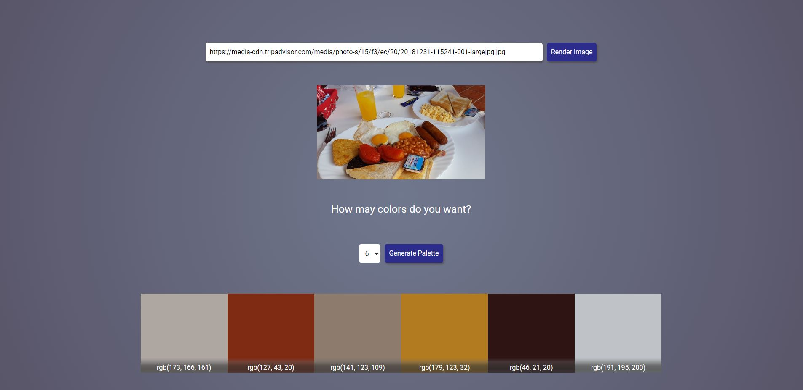

<h1 align="center">
     Color Palette Generator with Machine Learningf
  <br>
</h1>

<h4 align="center">A simple color palette generator built with <a href="https://pyscript.net/">pyscript<a></h4>

<p align="center">


<a href='https://github.com/shivamkapasia0' target="_blank"></a>
<a href='https://github.com/shivamkapasia0' target="_blank"></a>

<p align="center">Badges from <a href="https://kapasia-dev-ed.my.site.com/Badges4Me/s/" target="_blank">Kapasia</a> and <a href="https://github-badges.netlify.app/" target="_blank"> Gh badges</a> </p>

<p align="center">
  <a href="#key-features">Key Features</a> •
  <a href="#how-to-use">How To Use</a> •
  <a href="#credits">Credits</a> 
</p>

<p align="center"></p>

## Key Features

- Machine learning unsupervised clustering
  - Thanks to k-means algorithm we can cluster the colors and select the most representatives
  - This could have been done with an histogram, but where is the fun on that?
- Pyscript proxy with javascript events
  - Pyscript allows the communication between js and python by proxies and specific attributes.

## How To Use

To clone and run this application, you'll need [Git](https://git-scm.com) and [Node.js](https://nodejs.org/en/download/) (which comes with [npm](http://npmjs.com)) installed on your computer. From your command line:

```bash
# Clone this repository
$ git clone https://github.com/Dalejan/colorsPalette.git

$ cd colorsPalette

# To correctly serve these files locally you must use http.server or similars
$ python -m http.server

```

Once the app is on you can go to `http://localhost:8000` and play around.

> **Note**
> The use of http.server is necessary for this project due to the modular file structure

<br>

## Credits

This software uses the following open source packages:

- [Pyscript](https://pyscript.net/)
- [Scikit-learn](https://scikit-learn.org/)

## You may also like...

- [3d-landing](https://github.com/Dalejan/3d-landing) - A 3d objects carousel

---

Built with <span role="img" aria-label="heart emoji">💖</span> By David Alejandro Quiñonez

> GitHub [@Dalejan](https://github.com/Dalejan)

More social network later :D
